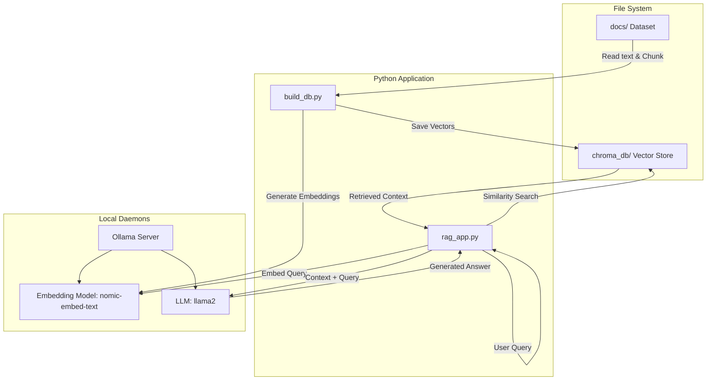

# 🏗️ RAGCraft – Architecture & Workflow

This document explains the technical architecture, data flow, and operational workflows for **RAGCraft**, a minimal Retrieval-Augmented Generation (RAG) engine.

## 1. System Architecture

The application is a locally hosted, privacy-first RAG pipeline using ChromaDB for persistent vector storage and Ollama for embedding generation and LLM inference.



### Key Components

1. **Document Ingestion (`build_db.py`):** 
   - Reads documents from `docs/` and tokenizes them into contextual chunks (using NLTK sentence chunking).
   - Secures uniqueness using deterministic UUIDs to avoid indexing collisions.
   - Pushes chunks to Ollama to generate embeddings.
   - Stores the text chunks, metadata, and embeddings persistently in `chroma_db`.

2. **Vector Database (`ChromaDB`):**
   - Lightweight, locally hosted vector database. It converts distances to similarity scores to accurately fetch matching chunks.

3. **Inference Engine (`rag_app.py`):**
   - Takes streaming inputs from the CLI.
   - Embeds user queries and searches ChromaDB for semantic matches.
   - Triggers the LLaMA model via Ollama to synthesize a grounded answer. Includes strict hallucination prevention logic.

---

## 2. File & Directory Breakdown

* `build_db.py`: Ingests `docs/` txt files, safely chunks text, requests embeddings in batches, and builds the database.
* `rag_app.py`: The main interactive terminal application. It handles query embeddings, context retrieval, prompt construction, and streaming AI responses.
* `chroma_db/`: Persistent directory created automatically where vectors are saved to disk.
* `docs/`: The knowledge base directory containing `.txt` files (like `cat-facts.txt`).
* `instructions.md / operations.md`: Detailed guidelines handling error mitigation, chunking strategy logic, and deployment instructions.

---

## 3. Data Flow Example: Asking a Question

1. **User asks a question** via the `rag_app.py` prompt (e.g., *"What is a cat's sleep schedule?"*).
2. `rag_app.py` passes the raw query to the Ollama embedding model (`nomic-embed-text`).
3. The embedding vector is returned and queried against `chroma_db`.
4. `ChromaDB` returns the top semantically similar chunks with distance/similarity metrics.
5. The application builds a rigorous system prompt wrapping the chunks: *"Use ONLY the following pieces of context..."*.
6. The compiled prompt is sent to the Ollama text generative model (`llama2`), and the response streams securely to the terminal, enforcing context constraints.

---

## 4. Development & Operation Workflow

### 4.1 First-time Setup
1. Ensure the Python virtual environment (`venv`) is active.
2. Ensure Ollama is running (`ollama serve`) and the necessary models are downloaded (`ollama pull nomic-embed-text`, `ollama pull llama2`).
3. Set your internal constants in the `.env` configuration file.

### 4.2 Building the Database
To hydrate the Vector Database, execute the build script. By default, it parses sentences dynamically:
```bash
python build_db.py
```
*(Use `python build_db.py --force` if you wish to overwrite an existing database schema without prompts).*

### 4.3 Running the Application
Once the database is successfully built, start the question-answering terminal:
```bash
python rag_app.py
```
You can now continuously query the application and debug log outputs (distance vs. similarity heuristics) directly within the console window.
